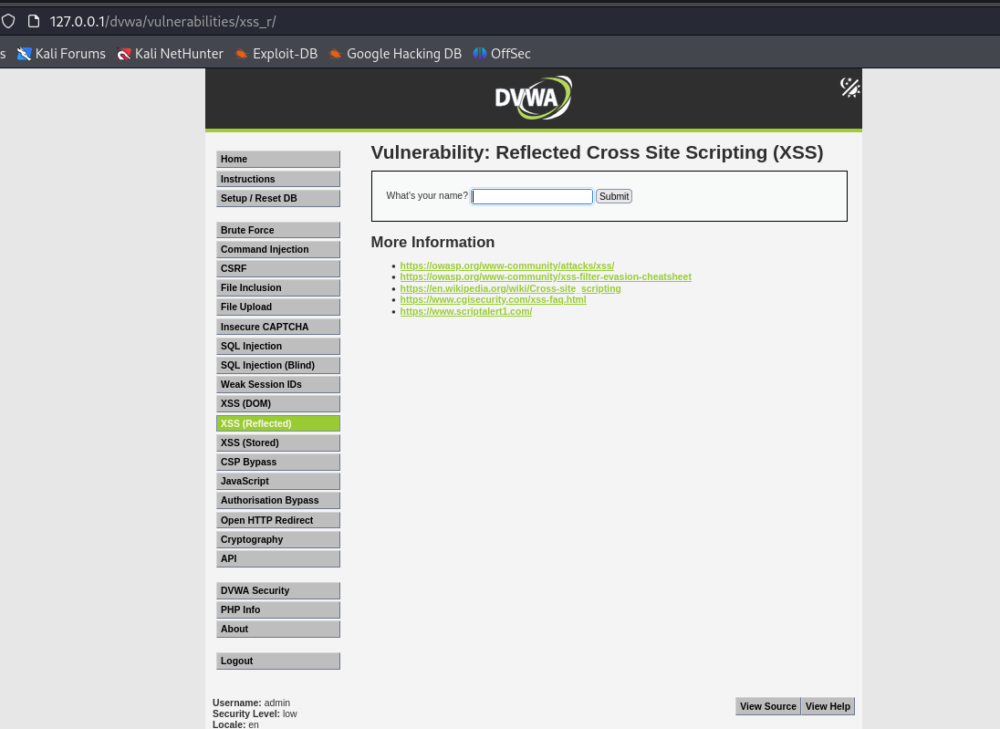
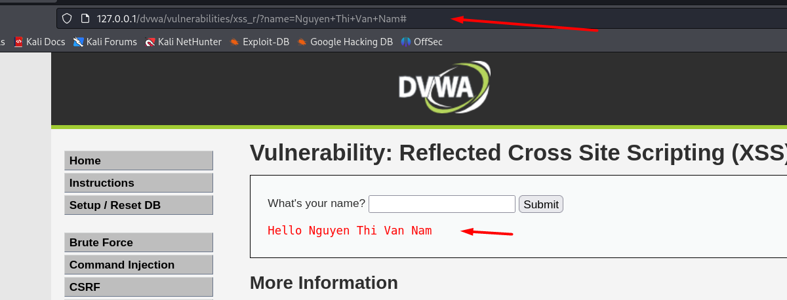
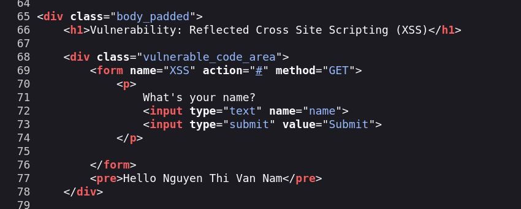
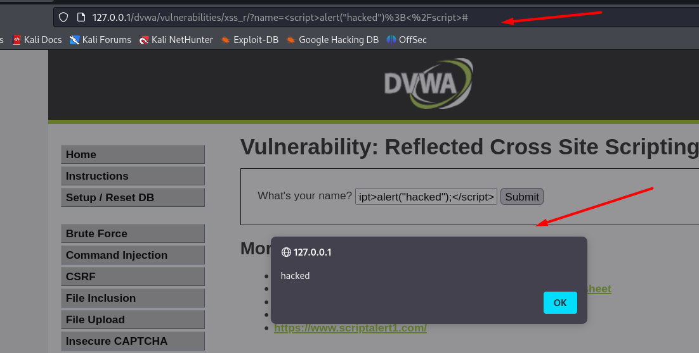

# XSS Reflected - mức độ : Low  

Vào "DVWA Security" ở sidebar bên trái, chọn mức độ Low (mặc định đang để là Impossible).  
Sau đó, chọn XSS Reflected ở sidebar để bắt đầu kiềm thử.

<p align="center">
  
</p>

Đây là giao diện ban đầu của <u>http://127.0.0.1/dvwa/vulnerabilities/xss_r/</u> , gồm 1 ô điền và 1 nút submit.

Ta thử nhập các câu, cũng như có thể check xem có giới hạn ký tự hay không để xác định khả năng chèn payload và cơ chế lọc đầu vào nếu nó không thể viết payload XSS đầy đủ.

<p align="center">
  
</p>


+ Sau khi nhập và ấn nút Submit, giao diện hiển thị : "Hello " + "từ đã nhập".  
+ URL chứa dữ liệu ta nhập, hiện trong thanh địa chỉ thông qua tham số name.

Ở HTML source code, trong form nhập liệu :
<p align="center">
  
</p>
Dữ liệu được gửi lên bằng phương thức GET, thông qua trường name. Nội dung hiển thị kết quả đầu vào người dùng:
<pre>Hello Nguyen Thi Van Nam</pre>
→ Tên vừa nhập được phản hồi lại ngay trên trang mà không qua xử lý gì cả.  

➝  Ta nghi ngờ liệu nó có cơ chế xử lý lọc/escape nào không.

Lần này chúng ta có thể thử gửi đoạn script này.
```html
<script>alert("hacked");</script>
```
<div style="text-align: center;">  </div>   

URL Encoding : 
<u> http://127.0.0.1/dvwa/vulnerabilities/xss_r/?name=%3Cscript%3Ealert%28%22hacked%22%29%3B%3C%2Fscript%3E# </u>
| Ký tự            | Encode    |
| ---------------- | -------------- |
| space (dấu cách) | `%20` hoặc `+` |
| `<`              | `%3C`          |
| `>`              | `%3E`          |
| `+`              | `%2B`          |
| `"`              | `%22`          |
| `'`              | `%27`          |
| `&`              | `%26`          |
| `/`              | `%2F`          |
| `=`              | `%3D`          |
| `#`              | `%23`          |

Dựa vào đường link trên, kẻ tấn công từ đó có thể đánh cắp dữ liệu phiên (session hijacking).
